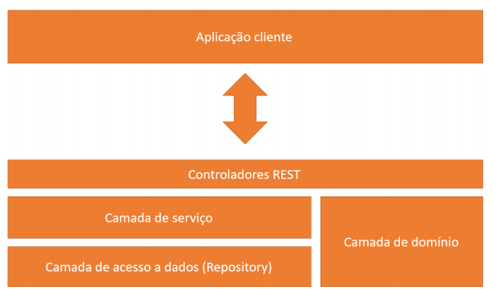
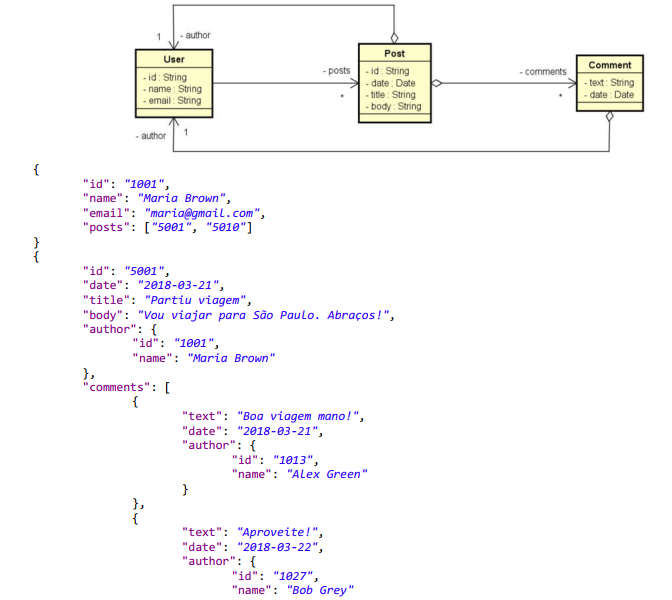
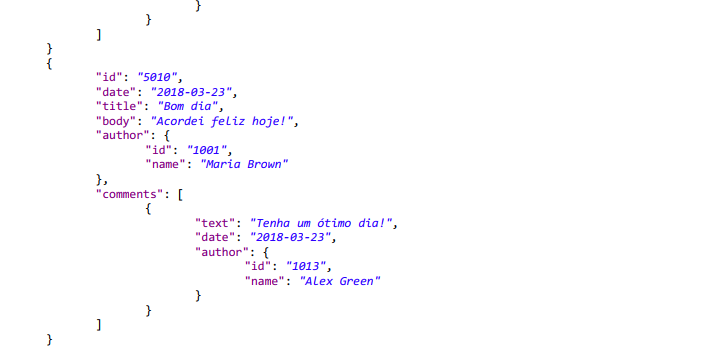
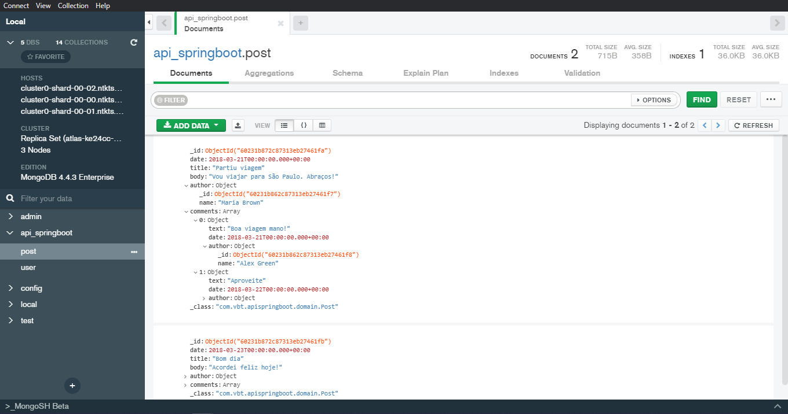
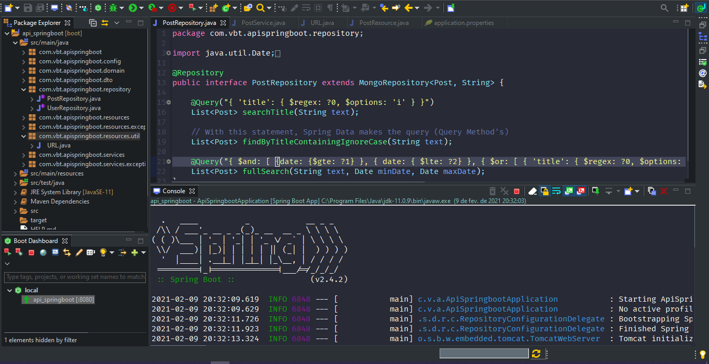
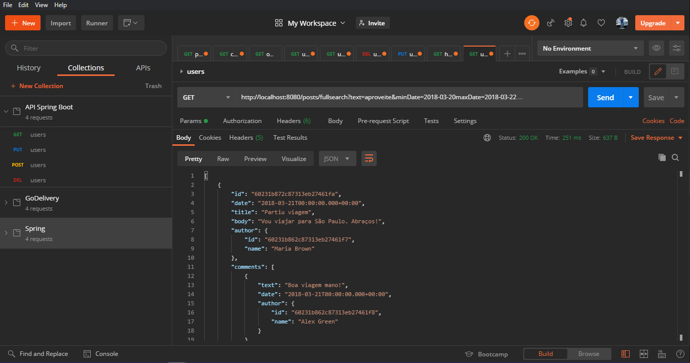

<h1 align="center">
    <br>API SPRING BOOT 1.0<br/>
    Spring Boot | Java | MongoDB
</h1>

<p align="center">
    
    
    
</p>

<p align="center">
    <a href="#bookmark-About-this-project">About</a>&nbsp;&nbsp;&nbsp;|&nbsp;&nbsp;&nbsp;
    <a href="#rocket-Technologies-used">Technology</a>&nbsp;&nbsp;&nbsp;|&nbsp;&nbsp;&nbsp;
    <a href="#boom-How-to-run">How to run</a>&nbsp;&nbsp;&nbsp;|&nbsp;&nbsp;&nbsp;
    <a href="#memo-License">License</a>
</p>

## :bookmark: About this project

The **API SPRING BOOT** is an application for users who post and these posts have comments, their storage structure is established in the NoSql MongoDB database and their data structure is stored in aggregates. The data structure is established on an AWS server in a cluster prepared for large volumes of requests and data traffic.

## :rocket: Technologies used

- Java version 11
- Spring Boot version 2.4.2
- Maven Version 4.0.0
- NoSql MongoDB database

## :wrench: Tools
- Spring Tool Suite 4
- MongoDB Compass
- AWS Amazon
- Postman

<p align="center">
<h4 align="left">Backend Structure</h4>
    
<p>

<p align="center">
<h4 align="left">Aggregate Objects</h4>
    
    
<p>

<p align="center">
<h4 align="left">MongoDB Compass</h4>
    
<p>

<p align="center">
<h4 align="left">Spring Tool Suit</h4>
    
<p>

<p align="center">
<h4 align="left">Checking endpoints with Postman</h4>
    
<p>

## :boom: How to run

- ### **Requirements**

  - It is **necessary** to have the Java 11 version installed and with the environment variable properly allocated for operation.
  - It is necessary to have the version of Spring Tool Suit 4 for the project to function properly.
  - For tests on the database test base, it is necessary to install version 4.4.3 of MongoDB, and for its data manipulation, install version 1.25 of MongoDB Compass.

You must start the local MongoDB server, for testing on the test basis:

```sh
  c:\ mongod
```

## :memo: License

This project is under the MIT license.
